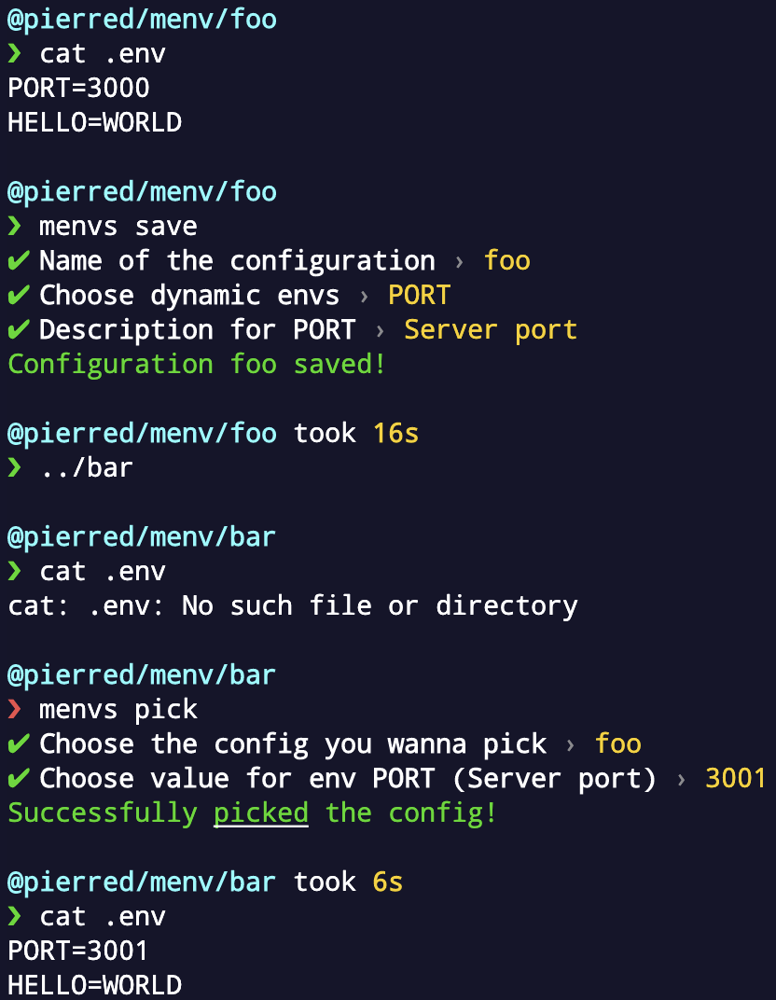

# menvs


[](https://github.com/PierreDemailly/menvs/commit-activity)
[](https://github.com/PierreDemailly/menvs/blob/main/LICENSE)


Manage .env across projects

## Requirements
- [Node.js](https://nodejs.org/en/) v16 or higher

## Getting Started

This package is available in the Node Package Repository and can be easily installed with [npm](https://docs.npmjs.com/getting-started/what-is-npm).

```bash
$ npm i -g menvs
```

Or use [npx](https://docs.npmjs.com/cli/v7/commands/npx).

```bash
$ npx menvs <command>
```

## Usage exemple

```bash
# save existing .env from project
$ cd path/to/project
$ menvs save
# reuse .env in another project
$ cd path/to/other/project
$ menvs pick
```



## Features

- Manage `.env` files across projects.
- Full interactive.
- Mark variables as **confidential** when includes `password` or `secret` (case insensitive) (i.e `DATABASE_PASSWORD` or `JWT_SECRET`).
- When updating config, allow to update all linked project `.env` files.

## CLI

| command | short | description |
| --- | --- | --- |
| save | s | Save a new configuration from an existing `.env`
| pick | p | Generate a `.env` from an existing configuration
| list | l | List available configurations
| delete | d | Delete a configuration
| show | sh | Show configuration key-values
| update | u | Update configuration (key / value )

## Contributors ✨

<!-- ALL-CONTRIBUTORS-BADGE:START - Do not remove or modify this section -->
[](#contributors-)
<!-- ALL-CONTRIBUTORS-BADGE:END -->

<!-- ALL-CONTRIBUTORS-LIST:START - Do not remove or modify this section -->
<!-- prettier-ignore-start -->
<!-- markdownlint-disable -->
<table>
  <tbody>
    <tr>
      <td align="center" valign="top" width="14.28%"><a href="https://github.com/PierreDemailly"><br /><sub><b>PierreDemailly</b></sub></a><br /><a href="https://github.com/PierreDemailly/menvs/commits?author=PierreDemailly" title="Code">💻</a></td>
    </tr>
  </tbody>
</table>

<!-- markdownlint-restore -->
<!-- prettier-ignore-end -->

<!-- ALL-CONTRIBUTORS-LIST:END -->

This project follows the [all-contributors](https://github.com/all-contributors/all-contributors) specification. Contributions of any kind welcome!

## License
MIT
